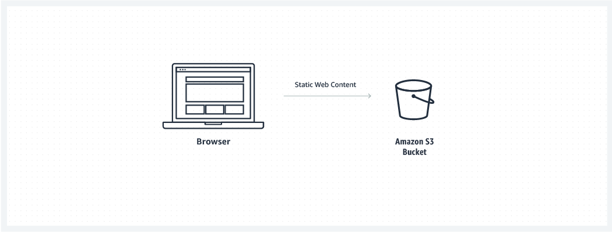

# Module1

Build a Static Website

## Overview

In this module, we'll host the static content _(html, js, css, media content, etc.)_ of Mythical Mysfit website on `Amazon S3` (Simple Storage Service). S3 is a highly durable, highly available, and inexpensive object storage service that can serve stored objects directly via HTTP. This makes it wonderfully useful for serving static web content directly to web browsers for sites on the Internet.  

Before we start storing our mysfits in S3, let's set up AWS Cloud9 for you. Cloud9 is a cloud-based integrated development environment (IDE) that lets you write, run, and debug your code with just a browser.  

## Architecture Diagram

## Services Used

* AWS Cloud9
* Amazon Simple Storage Service (S3)